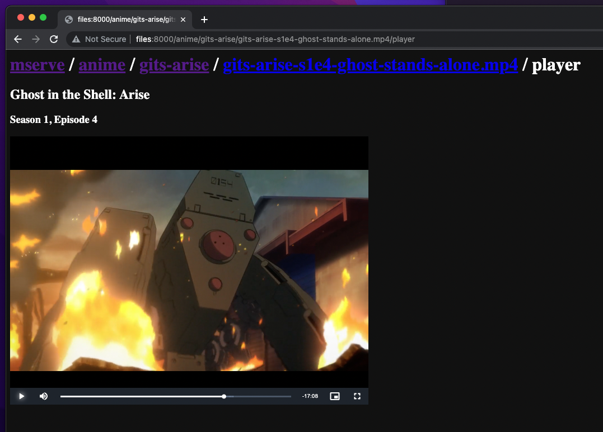

# mserve.py

A single-file, zero dependency Python media server.

Usage: `./mserve.py`, then open http://localhost:8000.

By default, content from `~/Movies` is served.
Override this via the `MSERVE_MEDIA_DIR` env var:

```
MSERVE_MEDIA_DIR=/home/bob/videos ./mserve.py`
```


## Screenshots





## Setup

`mserve.py` does not maintain a database about your video files -- it just uses your filesystem.

Directory and file naming is expected to follow a [slug](https://en.wikipedia.org/wiki/Clean_URL#Slug) format for compatibility as HTTP URLs. 

`mserve.py` can only "see" directories which have an `mserve.json` file.

Organizational directories (which contain other directories, e.g. `movies`, `tv`, etc)
need an `mserve.json` with `type` set to `directory`:

```json
{ "type": "directory" }
```

Directories which contain a single movie (e.g. `godfather-part-ii`) need a `type` of `movie`:

```json
{
    "type": "movie",
    "title": "The Godfather Part II"
}
```

Directories which contain a series (e.g. `rick-and-morty`) need a `type` of `series`:

```json
{
    "type": "series",
    "title": "Rick and Morty"
}
```

An example filesystem layout:

```
$ tree ~/Movies
~/Movies
├── movies
│   ├── godfather-part-ii
│   │   ├── godfather-part-ii.mp4
│   │   └── mserve.json
│   └── mserve.json
├── mserve.json
└── tv
    ├── mserve.json
    └── rick-and-morty
        ├── mserve.json
        ├── rick-and-morty-s1e1.mkv
        ├── rick-and-morty-s1e2.mkv
        └── rick-and-morty-s1e3.mkv
```

The above filesystem layout would result in the following URLs being valid:

```
http://localhost:8000
http://localhost:8000/movies
http://localhost:8000/movies/godfather-part-ii
http://localhost:8000/movies/godfather-part-ii/godfather-part-ii.mp4
http://localhost:8000/movies/godfather-part-ii/godfather-part-ii.mp4/player
http://localhost:8000/tv
http://localhost:8000/tv/rick-and-morty
http://localhost:8000/tv/rick-and-morty/rick-and-morty-s1e1.mkv
http://localhost:8000/tv/rick-and-morty/rick-and-morty-s1e1.mkv/player
http://localhost:8000/tv/rick-and-morty/rick-and-morty-s1e2.mkv
http://localhost:8000/tv/rick-and-morty/rick-and-morty-s1e2.mkv/player
http://localhost:8000/tv/rick-and-mortyrick-and-morty-s1e3.mkv
http://localhost:8000/tv/rick-and-mortyrick-and-morty-s1e3.mkv/player
```


## iOS VLC.app integration

`mserve.py` generates `vlc-x-callback://` URLs which will deep-link into the [VLC iOS app](https://apps.apple.com/us/app/vlc-media-player/id650377962).


## macOS VLC integration via VLCFileUrl.app

To handle filetypes which are not compatible with HTML5 `<video>` (i.e `.mkv` files),
`mserve.py` generates `vlc-file://` URLs.

Install the [VLCFileUrl app](https://github.com/pepaslabs/VLCFileUrl) and tell your browser to use it to handle `vlc-file://` URLs.  VLCFileUrl will then launch [VLC](https://www.videolan.org/vlc/) with a corresponding `http://` URL and stream the video.


## License

[MIT](https://opensource.org/license/mit/), baby 😎.
